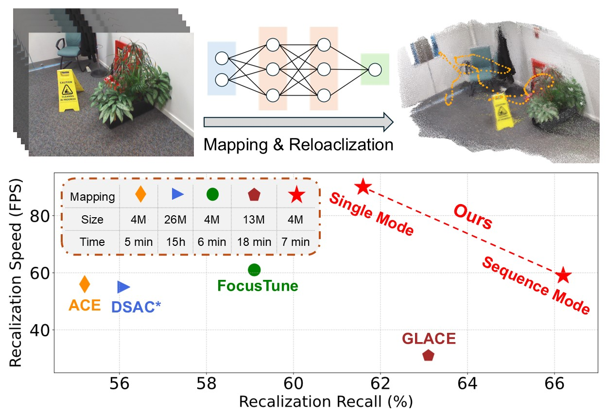

<h1 align="center">Enhancing Scene Coordinate Regression with Efficient Keypoint
Detection and Sequential Information</h1>

<p align="center"><strong>
    <a href = "https://scholar.google.com/citations?user=-p7HvCMAAAAJ&hl=zh-CN">Kuan Xu</a><sup>1</sup>,
    <a href = "https://the-masses.github.io/">Zeyu Jiang</a><sup>1</sup>,
    <a href = "https://aroncao49.github.io/">Haozhi Cao</a><sup>1</sup>,
    <a href = "https://scholar.google.com/citations?user=XcV_sesAAAAJ&hl=en">Shenghai Yuan</a><sup>1</sup>,
    <a href = "https://sairlab.org/team/chenw/">Chen Wang</a><sup>2</sup>,
    <a href = "https://scholar.google.com.sg/citations?user=Fmrv3J8AAAAJ&hl=en">Lihua Xie</a><sup>1</sup>
</strong></p>

<p align="center"><strong>
    <a href = "https://www.ntu.edu.sg/cartin">1: Centre for Advanced Robotics Technology Innovation (CARTIN), Nanyang Technological University</a><br>
    <a href = "https://sairlab.org/">2: Spatial AI & Robotics (SAIR) Lab, Computer Science and Engineering, University at Buffalo</a><br>
</strong></p>

<p align="center"><strong> 
    <a href = "https://arxiv.org/abs/2412.06488">&#128196; [PDF]</a> &nbsp; &nbsp; | &nbsp; &nbsp;
    <a href = "supplementary/Additional_experimental_results.pdf">&#128202; [Supplementary]</a> 
    <!-- <a href = "https://xukuanhit.github.io/airslam/">&#128190; [Project Site]</a> |
    <a href = "https://youtu.be/5OcR5KeO5nc">&#127909; [Youtube]</a> |
    <a href = "https://www.bilibili.com/video/BV1rJY7efE9x">&#127909; [Bilibili]</a> -->
</strong></p>


<p align="middle">
  
</p>


In this paper, we propose an efficient scene coordinate encoding and relocalization method. Compared with the existing SCR methods, we design a unified architecture for both scene encoding and salient keypoint detection, enabling our system to focus on encoding informative regions, thereby significantly enhancing efficiency.
Additionally, we introduce a mechanism that leverages sequential information during both map encoding and relocalization, which strengthens implicit triangulation, particularly in repetitive texture environments. Comprehensive experiments conducted across indoor and outdoor datasets demonstrate the proposed system outperforms other state-of-the-art (SOTA) SCR methods. 
Our single-frame relocalization mode improves the recall rate of our baseline by 6.4\% and increases the running speed from 56Hz to 90Hz.
Furthermore, our sequence-based mode increases the recall rate by 11\% while maintaining the original efficiency.

<p align="middle">
  
</p>

----------------------------------------------------------------------------------------


## Updates
* [2025.07] The paper was officially accepted to IEEE Robotics and Automation Letters (RA-L).
* [2024.12] The code was relesed.


## Installation

This code uses PyTorch to train and evaluate the scene-specific coordinate prediction head networks. It has been tested
on Ubuntu 20.04 with a Nvidia 3090 GPU, although it should reasonably run with other Linux distributions and GPUs as well.

We provide a pre-configured [`conda`](https://docs.conda.io/en/latest/) environment containing all required dependencies
necessary to run our code.
You can re-create and activate the environment with:

```shell
conda env create -f environment.yml
conda activate seq_ace
```

**All the following commands in this file need to run in the `seq_ace` environment.**

The network predicts dense 3D scene coordinates associated to the pixels of the input images.
In order to estimate the 6DoF camera poses, it relies on the RANSAC implementation of the DSAC* paper (Brachmann and
Rother, TPAMI 2021), which is written in C++.
As such, you need to build and install the C++/Python bindings of those functions.
You can do this with:

```shell
cd dsacstar
python setup.py install
```

Having done the steps above, you are ready to experiment with SeqACE!

## Datasets

Our method has been evaluated using multiple published datasets:

- [Microsoft 7-Scenes](https://www.microsoft.com/en-us/research/project/rgb-d-dataset-7-scenes/)
- [Stanford 12-Scenes](https://graphics.stanford.edu/projects/reloc/)
- [Cambridge Landmarks](https://www.repository.cam.ac.uk/handle/1810/251342/)

We provide scripts in the `datasets` folder to automatically download and extract the data in a format that can be
readily used by the SeqACE scripts.
The format is the same used by the DSAC* codebase, see [here](https://github.com/vislearn/dsacstar#data-structure) for
details.

> **Important: make sure you have checked the license terms of each dataset before using it.**

### {7, 12}-Scenes:

You can use the `datasets/setup_{7,12}scenes.py` scripts to download the data:
```shell
cd datasets
# Downloads the data to datasets/pgt_7scenes_{chess, fire, ...}
./setup_7scenes.py --poses pgt
# Downloads the data to datasets/pgt_12scenes_{apt1_kitchen, ...}
./setup_12scenes.py --poses pgt
``` 

### Cambridge Landmarks:

We used a single variant of these datasets. Simply run:
```shell
cd datasets
# Downloads the data to datasets/Cambridge_{GreatCourt, KingsCollege, ...}
./setup_cambridge.py
```

## Usage

We provide scripts to train and evaluate the scene coordinate regression networks.
In the following sections, we'll detail some of the main command line options that can be used to customize the
behavior of both the training and the pose estimation script.

### Training

First, keypoints need to be extracted and matched offline to enable sequence-based training. We provide the `feature_matching_for_traing.py` script where `dataroot` and `sequences` must be modified according to your own paths.

```shell
python feature_matching_for_traing.py <dataroot> <sequences>
# Example:
python feature_matching_for_traing.py datasets pgt_7scenes_chess pgt_7scenes_heads
```


Then the scene-specific coordinate regression head for a scene can be trained using the `train_ace.py` script.
Basic usage:

```shell
./train_ace.py <scene path> <output map name>
# Example:
./train_ace.py datasets/pgt_7scenes_chess output/pgt_7scenes_chess.pt
```

The output map file contains just the weights of the scene-specific head network -- encoded as half-precision floating
point -- for a size of ~4MB when using default options, as mentioned in the paper. The testing script will use these
weights, together with the scene-agnostic pretrained encoders (`ace_encoder_pretrained.pt` and `point_header.pt`) we provide, to estimate 6DoF
poses for the query images.


### Evaluation

The pose estimation for a testing scene can be performed using the `test_ace_feature.py` script.
Basic usage:

```shell
./test_ace_feature.py <scene path> <output map name>
# Example:
./test_ace_feature.py datasets/pgt_7scenes_chess output/pgt_7scenes_chess.pt
# Run single mode:
./test_ace_feature.py datasets/pgt_7scenes_chess output/pgt_7scenes_chess.pt --test_mode 2
```


## Publications

If you our code in your own work, please cite:

```
@misc{xu2024efficientscenecoordinateencoding,
      title={An Efficient Scene Coordinate Encoding and Relocalization Method}, 
      author={Kuan Xu and Zeyu Jiang and Haozhi Cao and Shenghai Yuan and Chen Wang and Lihua Xie},
      year={2024},
      eprint={2412.06488},
      archivePrefix={arXiv},
      primaryClass={cs.RO},
      url={https://arxiv.org/abs/2412.06488}, 
}
```

Our code builds on ACE. Please consider citing:

```
@inproceedings{brachmann2023ace,
    title={Accelerated Coordinate Encoding: Learning to Relocalize in Minutes using RGB and Poses},
    author={Brachmann, Eric and Cavallari, Tommaso and Prisacariu, Victor Adrian},
    booktitle={CVPR},
    year={2023},
}
```

## Additional Experiments

The additional evaluation and comparison results are provided in [this file](supplementary/Additional_experimental_results.pdf).


## License

Copyright © Niantic, Inc. 2023. Patent Pending.
All rights reserved.
Please see the [license file](LICENSE) for terms.
